3. Graphs
================
Antonio Dagnino Mendez
2/20/2021

## R Markdown

This is an R Markdown document. Markdown is a simple formatting syntax
for authoring HTML, PDF, and MS Word documents. For more details on
using R Markdown see <http://rmarkdown.rstudio.com>.

When you click the **Knit** button a document will be generated that
includes both content as well as the output of any embedded R code
chunks within the document. You can embed an R code chunk like this:

``` r
summary(cars)
```

    ##      speed           dist       
    ##  Min.   : 4.0   Min.   :  2.00  
    ##  1st Qu.:12.0   1st Qu.: 26.00  
    ##  Median :15.0   Median : 36.00  
    ##  Mean   :15.4   Mean   : 42.98  
    ##  3rd Qu.:19.0   3rd Qu.: 56.00  
    ##  Max.   :25.0   Max.   :120.00

## Including Plots

You can also embed plots, for example:

<!-- -->

Note that the `echo = FALSE` parameter was added to the code chunk to
prevent printing of the R code that generated the plot.

``` r
library(dplyr)
```

    ## Warning: package 'dplyr' was built under R version 4.0.4

    ## 
    ## Attaching package: 'dplyr'

    ## The following objects are masked from 'package:stats':
    ## 
    ##     filter, lag

    ## The following objects are masked from 'package:base':
    ## 
    ##     intersect, setdiff, setequal, union

``` r
library(ggplot2)
```

    ## Warning: package 'ggplot2' was built under R version 4.0.5

``` r
library(ggthemes)
```

    ## Warning: package 'ggthemes' was built under R version 4.0.4

``` r
library(data.table)
```

    ## Warning: package 'data.table' was built under R version 4.0.4

    ## 
    ## Attaching package: 'data.table'

    ## The following objects are masked from 'package:dplyr':
    ## 
    ##     between, first, last

``` r
#install.packages("data.table")
```

Line Charts

``` r
plot(x=1:10,y=(1:10)*2,type="o",col="blue",main="Lineplot",xlab = "X Axis",ylab = "Y Axis",pch=10,lty=30,axes=F)
lines(seq(from=3,to=18,by=3),type="l",col="red",pch=22,lty=10)
lines(1:10,type="b",col="dark green",pch=0,lty=1)
legend(x=1,y=17,legend=c("Red Line","Blue Line","Green Line"),col=c("red","blue","green"),lty=c(30,10,1),cex=0.8)
axis(side=1,at=seq(0,10,0.5),cex.axis=0.8)
axis(side=2,at=seq(0,20,2),cex.axis=0.8)
```

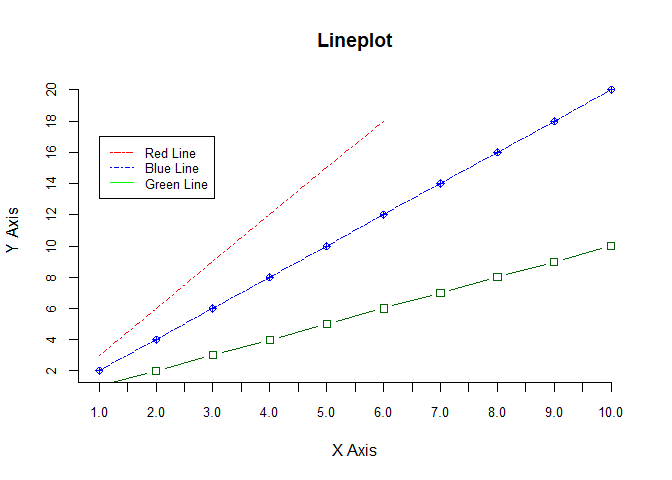<!-- -->

Bar Charts

``` r
par(mfrow=c(1,2),cex=0.8, mai=c(0,0.35,0.1,0.1))
barplot(seq(2,20,2),col="light blue")
barplot(seq(20,2,-2),col="dark green")
```

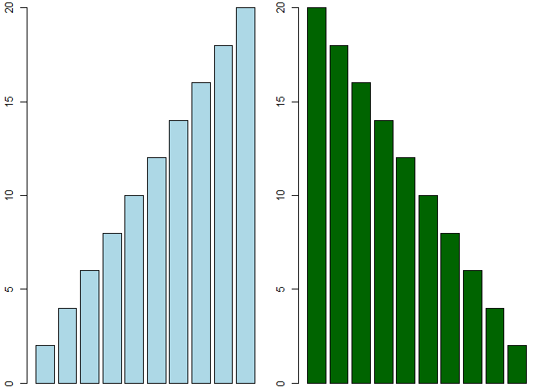<!-- --> Histograms

``` r
hist(rbinom(1:100,50,0.5),xlab="X Axis",main="Main Title",breaks=c(0:40))
```

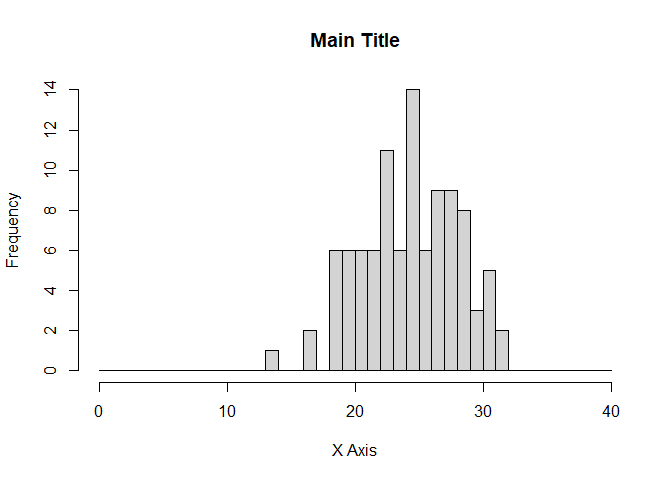<!-- -->

Pie Charts

``` r
slices <- tapply(
      subset(iris, Sepal.Length <7, select= c("Sepal.Length","Species"))$Sepal.Length,
      INDEX = subset(iris, Sepal.Length <7, select= c("Sepal.Length","Species"))$Species,
      FUN=mean
       )

lbl <- names(slices)
pct <- round(slices/sum(slices)*100) # Calculate percentages
lbl <- paste(lbl, pct) # add percents to labels
lbl <- paste(lbl,"%",sep="") # ad % to labels


pie(x=slices,
    labels=lbl,
    main="Sepal Length (less than 7 cm)",
    col = c("Light Yellow","Light Green","Light Blue")
    )
```

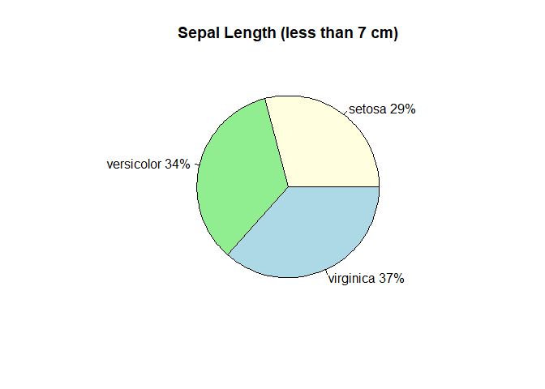<!-- -->

## ggplot

``` r
head(mpg)
```

    ## # A tibble: 6 x 11
    ##   manufacturer model displ  year   cyl trans      drv     cty   hwy fl    class 
    ##   <chr>        <chr> <dbl> <int> <int> <chr>      <chr> <int> <int> <chr> <chr> 
    ## 1 audi         a4      1.8  1999     4 auto(l5)   f        18    29 p     compa~
    ## 2 audi         a4      1.8  1999     4 manual(m5) f        21    29 p     compa~
    ## 3 audi         a4      2    2008     4 manual(m6) f        20    31 p     compa~
    ## 4 audi         a4      2    2008     4 auto(av)   f        21    30 p     compa~
    ## 5 audi         a4      2.8  1999     6 auto(l5)   f        16    26 p     compa~
    ## 6 audi         a4      2.8  1999     6 manual(m5) f        18    26 p     compa~

## Histogram

``` r
pl <- ggplot(data=mpg, aes(x=hwy))
pl + geom_histogram(binwidth=1,fill="black",color="#56ea29", alpha=0.5) + xlab("HWY") + ggtitle("Histogram") + coord_cartesian(xlim=c(0,50),ylim=c(0,40))
```

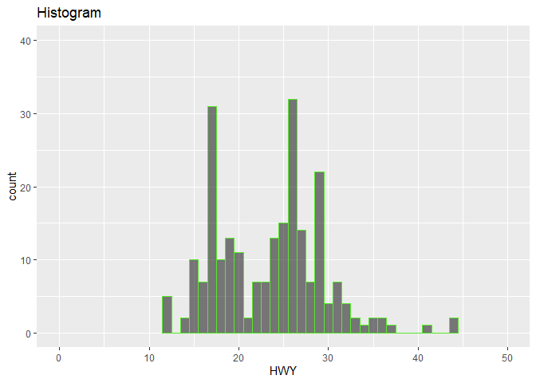<!-- -->

## Histogram

``` r
pl <- ggplot(mpg, aes(x=factor(manufacturer)))
pl + geom_bar(aes(fill=factor(cyl))) + scale_fill_brewer(palette="Reds") + theme_classic()
```

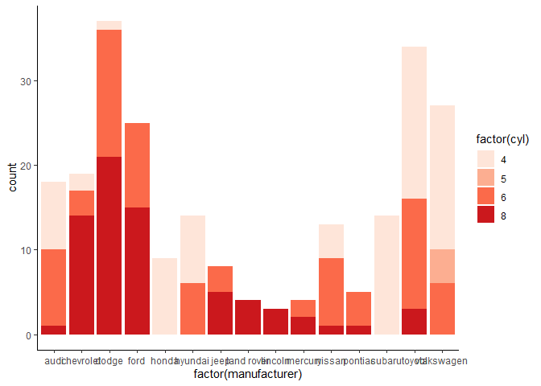<!-- -->

## Scatterplot

``` r
pl <- ggplot(txhousing,aes(y=volume,x=sales))
pl + geom_point(alpha=0.5,color="#296d22") + geom_smooth(model=lm,color="red")
```

    ## Warning: Ignoring unknown parameters: model

    ## `geom_smooth()` using method = 'gam' and formula 'y ~ s(x, bs = "cs")'

    ## Warning: Removed 568 rows containing non-finite values (stat_smooth).

    ## Warning: Removed 568 rows containing missing values (geom_point).

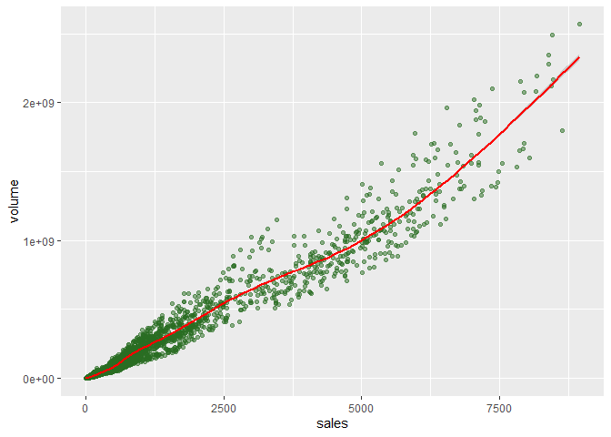<!-- --> \#\# The
Economist DF

``` r
mydir <- "C:/Users/anton/Google Drive/Master in Data Science/Courses/4. R ML Bootcamp/R-Course-HTML-Notes/R-for-Data-Science-and-Machine-Learning/Training Exercises/Capstone and Data Viz Projects/Data Visualization Project/Economist_Assignment_Data.csv"
ecom <- fread(mydir,drop=1)
head(ecom)
```

    ##        Country HDI.Rank   HDI CPI            Region
    ## 1: Afghanistan      172 0.398 1.5      Asia Pacific
    ## 2:     Albania       70 0.739 3.1 East EU Cemt Asia
    ## 3:     Algeria       96 0.698 2.9              MENA
    ## 4:      Angola      148 0.486 2.0               SSA
    ## 5:   Argentina       45 0.797 3.0          Americas
    ## 6:     Armenia       86 0.716 2.6 East EU Cemt Asia

``` r
pointsToLabel <- c("Russia", "Venezuela", "Iraq", "Myanmar", "Sudan",
                   "Afghanistan", "Congo", "Greece", "Argentina", "Brazil",
                   "India", "Italy", "China", "South Africa", "Spane",
                   "Botswana", "Cape Verde", "Bhutan", "Rwanda", "France",
                   "United States", "Germany", "Britain", "Barbados", "Norway", "Japan",
                   "New Zealand", "Singapore")


pl <- ggplot(ecom, aes(x=CPI, y=HDI, color=Region)) + geom_point(size=3,shape=1) + geom_smooth(aes(group=1),method="lm",formula=y~log(x),se=F,color="red") +geom_text(aes(label=Country),color="gray20",data=subset(ecom,Country %in% pointsToLabel),check_overlap=T)+ theme_economist_white() + scale_x_continuous(name="Corruption Perceptions Index",limits=c(0.9,10.5),breaks=1:10) +scale_y_continuous(name="Human Development Index",limits=c(0,1),breaks=seq(0,1,0.2)) + ggtitle("Corruption")
pl
```

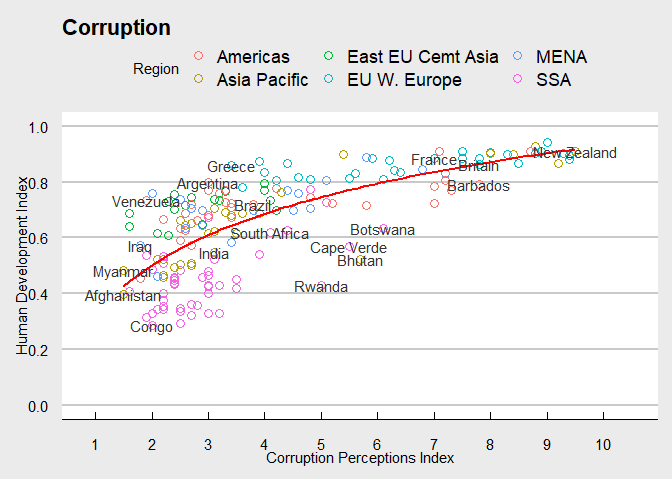<!-- -->

## Create Dummy Data Frame

``` r
df <- data.frame(
  "Year" = sample(2018:2021,50,replace=T),
  "Month" = sample(month.name,50,replace=T),
  "Expenses" = sample(100:1000,50,replace=T)
)

df$Month <- factor(df$Month,levels=month.name)

head(df)
```

    ##   Year    Month Expenses
    ## 1 2019  January      322
    ## 2 2021 February      927
    ## 3 2020 February      625
    ## 4 2018 November      610
    ## 5 2021 February      644
    ## 6 2018     July      188

## Bar graph

``` r
df_bar <- df %>% group_by(Year,Month) %>% summarise(Expenses=sum(Expenses)) %>% filter(Year == 2018)
```

    ## `summarise()` has grouped output by 'Year'. You can override using the `.groups` argument.

``` r
ggplot(df_bar,aes(x=Month,y=Expenses)) +geom_col() + theme_wsj()
```

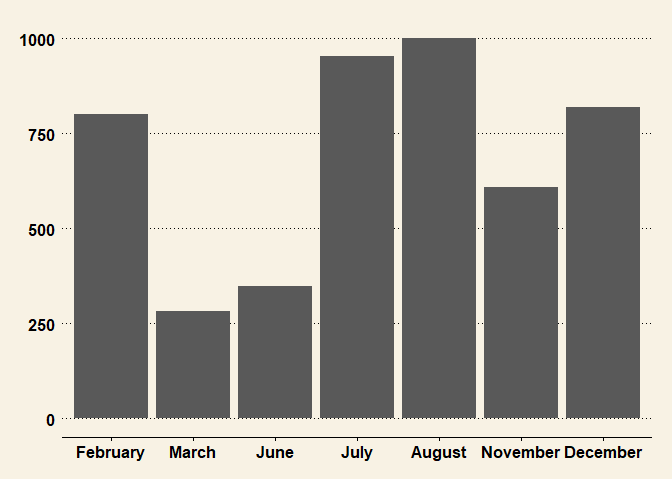<!-- -->

## Normal Distrbution Check!

``` r
ggplot(data=iris, aes(x=Sepal.Length)) +
geom_histogram(binwidth=0.8,fill="black",color="#56ea29", alpha=0.5,aes(y=..density..))+
geom_density(kernel="gaussian",col="green",linetype=5,size=1) + stat_density(aes(col="Data Dist"),geom="line")+ stat_function(fun=function(x){dnorm(x,mean=mean(iris$Sepal.Length),sd=sd(iris$Sepal.Length))},size=1,aes(col="Normal Dist")) + scale_colour_manual("Legend:",breaks=c("Data Dist","Normal Dist"),values=c("green","blue"))+ scale_x_continuous(breaks=2:9,limits = c(2,9))+ scale_y_continuous(breaks=seq(0,0.8,0.1),limits = c(0,0.8))+ labs(title="Sepal Length Distribution",x="Length",subtitle="---Subtitle---") + theme_clean()+ theme(legend.position = c(0.2,.5))
```

    ## Warning: Removed 1 rows containing missing values (geom_bar).

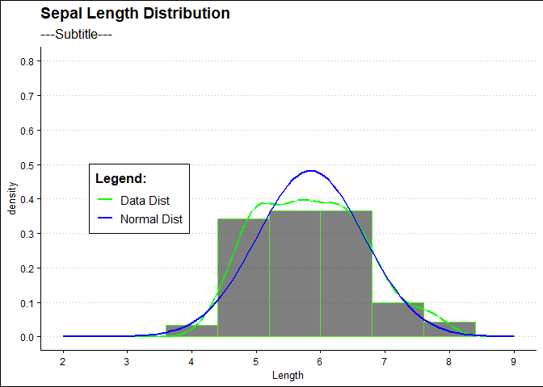<!-- -->

## Linear Regression model with built-in functions

``` r
#Linear regression with male female cats
library(MASS)
```

    ## Warning: package 'MASS' was built under R version 4.0.4

    ## 
    ## Attaching package: 'MASS'

    ## The following object is masked from 'package:dplyr':
    ## 
    ##     select

``` r
plot(x=cats$Bwt,y=cats$Hwt, xlab="Cat Weight",ylab="Cat's Heart Weight", main="Linear Regression Model",axes=F)
abline(lm(cats$Hwt~cats$Bwt),lwd=2)
points(x=with(cats, Bwt[Sex=="F"]),y=with(cats, Hwt[Sex=="F"]),col="pink",pch=20)
points(x=with(cats, Bwt[Sex=="M"]),y=with(cats, Hwt[Sex=="M"]),col="blue",pch=20)
legend(x=2,y=18,legend=c("Female","Male"),col=c("Pink","Blue"),pch=20)
axis(side=1, at=seq(0,4,0.1),cex.axis=0.8)
axis(side=2, at=seq(0,20,1),cex.axis=0.8)
```

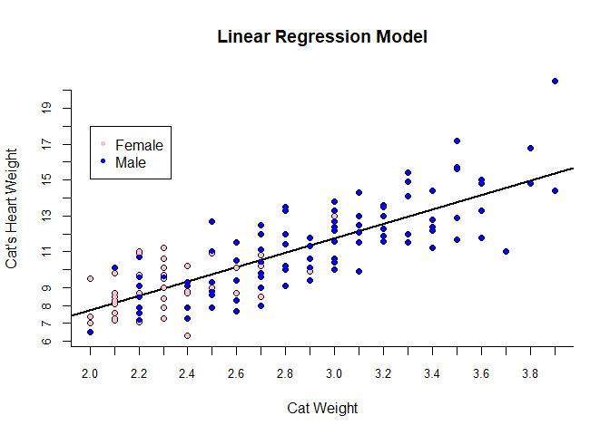<!-- --> \#\#
Boxplots

``` r
ggplot(data=mtcars,aes(y=mpg,x=cyl)) + geom_boxplot(aes(fill=factor(cyl))) + labs(title="mpg by cyl",x="cyl",y="mpg") + scale_fill_brewer(palette = "Greens",name="cyl")+theme_clean()
```

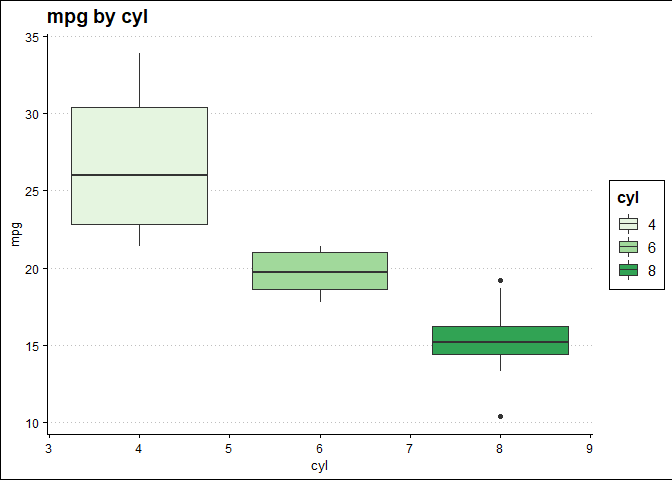<!-- --> \#\#
Correlation plots

``` r
library(corrplot)
```

    ## Warning: package 'corrplot' was built under R version 4.0.4

    ## corrplot 0.84 loaded

``` r
str(mtcars) #structure
```

    ## 'data.frame':    32 obs. of  11 variables:
    ##  $ mpg : num  21 21 22.8 21.4 18.7 18.1 14.3 24.4 22.8 19.2 ...
    ##  $ cyl : num  6 6 4 6 8 6 8 4 4 6 ...
    ##  $ disp: num  160 160 108 258 360 ...
    ##  $ hp  : num  110 110 93 110 175 105 245 62 95 123 ...
    ##  $ drat: num  3.9 3.9 3.85 3.08 3.15 2.76 3.21 3.69 3.92 3.92 ...
    ##  $ wt  : num  2.62 2.88 2.32 3.21 3.44 ...
    ##  $ qsec: num  16.5 17 18.6 19.4 17 ...
    ##  $ vs  : num  0 0 1 1 0 1 0 1 1 1 ...
    ##  $ am  : num  1 1 1 0 0 0 0 0 0 0 ...
    ##  $ gear: num  4 4 4 3 3 3 3 4 4 4 ...
    ##  $ carb: num  4 4 1 1 2 1 4 2 2 4 ...

``` r
cor(mtcars) #correlation matrix
```

    ##             mpg        cyl       disp         hp        drat         wt
    ## mpg   1.0000000 -0.8521620 -0.8475514 -0.7761684  0.68117191 -0.8676594
    ## cyl  -0.8521620  1.0000000  0.9020329  0.8324475 -0.69993811  0.7824958
    ## disp -0.8475514  0.9020329  1.0000000  0.7909486 -0.71021393  0.8879799
    ## hp   -0.7761684  0.8324475  0.7909486  1.0000000 -0.44875912  0.6587479
    ## drat  0.6811719 -0.6999381 -0.7102139 -0.4487591  1.00000000 -0.7124406
    ## wt   -0.8676594  0.7824958  0.8879799  0.6587479 -0.71244065  1.0000000
    ## qsec  0.4186840 -0.5912421 -0.4336979 -0.7082234  0.09120476 -0.1747159
    ## vs    0.6640389 -0.8108118 -0.7104159 -0.7230967  0.44027846 -0.5549157
    ## am    0.5998324 -0.5226070 -0.5912270 -0.2432043  0.71271113 -0.6924953
    ## gear  0.4802848 -0.4926866 -0.5555692 -0.1257043  0.69961013 -0.5832870
    ## carb -0.5509251  0.5269883  0.3949769  0.7498125 -0.09078980  0.4276059
    ##             qsec         vs          am       gear        carb
    ## mpg   0.41868403  0.6640389  0.59983243  0.4802848 -0.55092507
    ## cyl  -0.59124207 -0.8108118 -0.52260705 -0.4926866  0.52698829
    ## disp -0.43369788 -0.7104159 -0.59122704 -0.5555692  0.39497686
    ## hp   -0.70822339 -0.7230967 -0.24320426 -0.1257043  0.74981247
    ## drat  0.09120476  0.4402785  0.71271113  0.6996101 -0.09078980
    ## wt   -0.17471588 -0.5549157 -0.69249526 -0.5832870  0.42760594
    ## qsec  1.00000000  0.7445354 -0.22986086 -0.2126822 -0.65624923
    ## vs    0.74453544  1.0000000  0.16834512  0.2060233 -0.56960714
    ## am   -0.22986086  0.1683451  1.00000000  0.7940588  0.05753435
    ## gear -0.21268223  0.2060233  0.79405876  1.0000000  0.27407284
    ## carb -0.65624923 -0.5696071  0.05753435  0.2740728  1.00000000

``` r
cor.test(mtcars$mpg,mtcars$disp) #correlation test between two variables
```

    ## 
    ##  Pearson's product-moment correlation
    ## 
    ## data:  mtcars$mpg and mtcars$disp
    ## t = -8.7472, df = 30, p-value = 9.38e-10
    ## alternative hypothesis: true correlation is not equal to 0
    ## 95 percent confidence interval:
    ##  -0.9233594 -0.7081376
    ## sample estimates:
    ##        cor 
    ## -0.8475514

``` r
corrplot(cor(mtcars),method="ellipse")
```

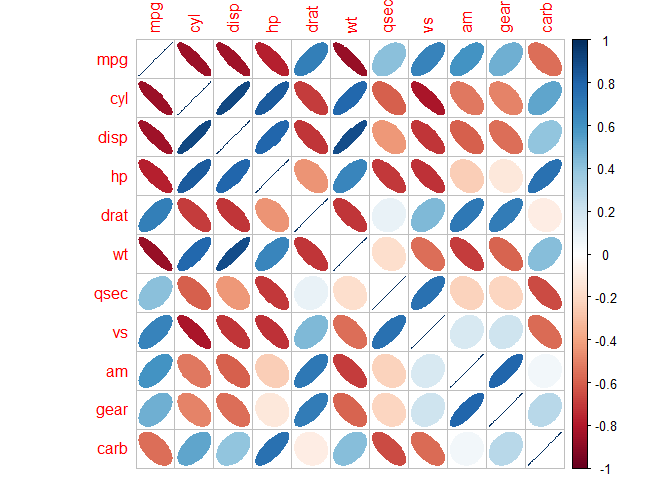<!-- -->

``` r
corrplot(cor(mtcars),method="circle")
```

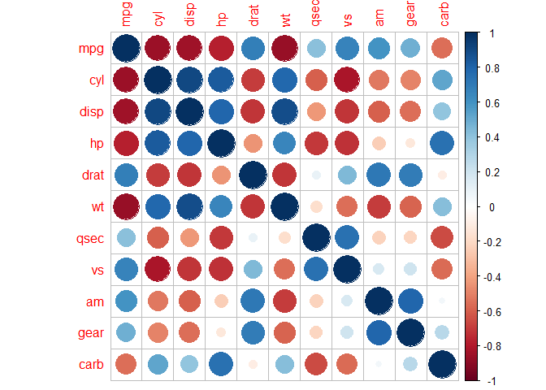<!-- -->

``` r
corrplot(cor(mtcars),method="square")
```

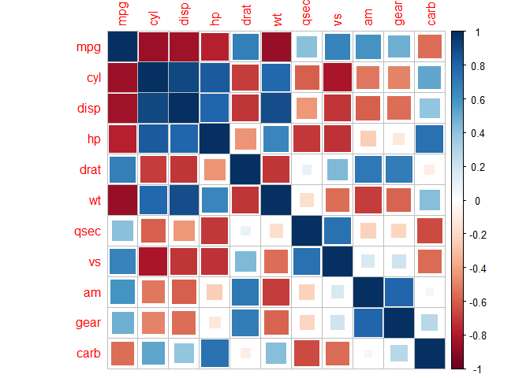<!-- -->

``` r
# go to https://cran.r-project.org/web/packages/corrplot/vignettes/corrplot-intro.html for more
```
