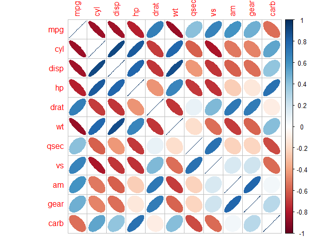

4. dplyr and tidyr Libraries
================
Antonio Dagnino Mendez
3/3/2021

## Dplyr, tidyr and data.table Libraries

``` r
library(dplyr)
```

    ## Warning: package 'dplyr' was built under R version 4.0.4

    ## 
    ## Attaching package: 'dplyr'

    ## The following objects are masked from 'package:stats':
    ## 
    ##     filter, lag

    ## The following objects are masked from 'package:base':
    ## 
    ##     intersect, setdiff, setequal, union

``` r
library(tidyr)
```

    ## Warning: package 'tidyr' was built under R version 4.0.4

``` r
library(data.table)
```

    ## Warning: package 'data.table' was built under R version 4.0.4

    ## 
    ## Attaching package: 'data.table'

    ## The following objects are masked from 'package:dplyr':
    ## 
    ##     between, first, last

## Data Frame

``` r
head(mtcars)
```

    ##                    mpg cyl disp  hp drat    wt  qsec vs am gear carb
    ## Mazda RX4         21.0   6  160 110 3.90 2.620 16.46  0  1    4    4
    ## Mazda RX4 Wag     21.0   6  160 110 3.90 2.875 17.02  0  1    4    4
    ## Datsun 710        22.8   4  108  93 3.85 2.320 18.61  1  1    4    1
    ## Hornet 4 Drive    21.4   6  258 110 3.08 3.215 19.44  1  0    3    1
    ## Hornet Sportabout 18.7   8  360 175 3.15 3.440 17.02  0  0    3    2
    ## Valiant           18.1   6  225 105 2.76 3.460 20.22  1  0    3    1

## Filter function

``` r
filter(mtcars,mpg>20,cyl==6)
```

    ##                 mpg cyl disp  hp drat    wt  qsec vs am gear carb
    ## Mazda RX4      21.0   6  160 110 3.90 2.620 16.46  0  1    4    4
    ## Mazda RX4 Wag  21.0   6  160 110 3.90 2.875 17.02  0  1    4    4
    ## Hornet 4 Drive 21.4   6  258 110 3.08 3.215 19.44  1  0    3    1

## Arrange function

``` r
arrange(mtcars,cyl,desc(wt))
```

    ##                      mpg cyl  disp  hp drat    wt  qsec vs am gear carb
    ## Merc 240D           24.4   4 146.7  62 3.69 3.190 20.00  1  0    4    2
    ## Merc 230            22.8   4 140.8  95 3.92 3.150 22.90  1  0    4    2
    ## Volvo 142E          21.4   4 121.0 109 4.11 2.780 18.60  1  1    4    2
    ## Toyota Corona       21.5   4 120.1  97 3.70 2.465 20.01  1  0    3    1
    ## Datsun 710          22.8   4 108.0  93 3.85 2.320 18.61  1  1    4    1
    ## Fiat 128            32.4   4  78.7  66 4.08 2.200 19.47  1  1    4    1
    ## Porsche 914-2       26.0   4 120.3  91 4.43 2.140 16.70  0  1    5    2
    ## Fiat X1-9           27.3   4  79.0  66 4.08 1.935 18.90  1  1    4    1
    ## Toyota Corolla      33.9   4  71.1  65 4.22 1.835 19.90  1  1    4    1
    ## Honda Civic         30.4   4  75.7  52 4.93 1.615 18.52  1  1    4    2
    ## Lotus Europa        30.4   4  95.1 113 3.77 1.513 16.90  1  1    5    2
    ## Valiant             18.1   6 225.0 105 2.76 3.460 20.22  1  0    3    1
    ## Merc 280            19.2   6 167.6 123 3.92 3.440 18.30  1  0    4    4
    ## Merc 280C           17.8   6 167.6 123 3.92 3.440 18.90  1  0    4    4
    ## Hornet 4 Drive      21.4   6 258.0 110 3.08 3.215 19.44  1  0    3    1
    ## Mazda RX4 Wag       21.0   6 160.0 110 3.90 2.875 17.02  0  1    4    4
    ## Ferrari Dino        19.7   6 145.0 175 3.62 2.770 15.50  0  1    5    6
    ## Mazda RX4           21.0   6 160.0 110 3.90 2.620 16.46  0  1    4    4
    ## Lincoln Continental 10.4   8 460.0 215 3.00 5.424 17.82  0  0    3    4
    ## Chrysler Imperial   14.7   8 440.0 230 3.23 5.345 17.42  0  0    3    4
    ## Cadillac Fleetwood  10.4   8 472.0 205 2.93 5.250 17.98  0  0    3    4
    ## Merc 450SE          16.4   8 275.8 180 3.07 4.070 17.40  0  0    3    3
    ## Pontiac Firebird    19.2   8 400.0 175 3.08 3.845 17.05  0  0    3    2
    ## Camaro Z28          13.3   8 350.0 245 3.73 3.840 15.41  0  0    3    4
    ## Merc 450SLC         15.2   8 275.8 180 3.07 3.780 18.00  0  0    3    3
    ## Merc 450SL          17.3   8 275.8 180 3.07 3.730 17.60  0  0    3    3
    ## Duster 360          14.3   8 360.0 245 3.21 3.570 15.84  0  0    3    4
    ## Maserati Bora       15.0   8 301.0 335 3.54 3.570 14.60  0  1    5    8
    ## Dodge Challenger    15.5   8 318.0 150 2.76 3.520 16.87  0  0    3    2
    ## Hornet Sportabout   18.7   8 360.0 175 3.15 3.440 17.02  0  0    3    2
    ## AMC Javelin         15.2   8 304.0 150 3.15 3.435 17.30  0  0    3    2
    ## Ford Pantera L      15.8   8 351.0 264 4.22 3.170 14.50  0  1    5    4

## Select function

``` r
select(mtcars, mpg,hp)
```

    ##                      mpg  hp
    ## Mazda RX4           21.0 110
    ## Mazda RX4 Wag       21.0 110
    ## Datsun 710          22.8  93
    ## Hornet 4 Drive      21.4 110
    ## Hornet Sportabout   18.7 175
    ## Valiant             18.1 105
    ## Duster 360          14.3 245
    ## Merc 240D           24.4  62
    ## Merc 230            22.8  95
    ## Merc 280            19.2 123
    ## Merc 280C           17.8 123
    ## Merc 450SE          16.4 180
    ## Merc 450SL          17.3 180
    ## Merc 450SLC         15.2 180
    ## Cadillac Fleetwood  10.4 205
    ## Lincoln Continental 10.4 215
    ## Chrysler Imperial   14.7 230
    ## Fiat 128            32.4  66
    ## Honda Civic         30.4  52
    ## Toyota Corolla      33.9  65
    ## Toyota Corona       21.5  97
    ## Dodge Challenger    15.5 150
    ## AMC Javelin         15.2 150
    ## Camaro Z28          13.3 245
    ## Pontiac Firebird    19.2 175
    ## Fiat X1-9           27.3  66
    ## Porsche 914-2       26.0  91
    ## Lotus Europa        30.4 113
    ## Ford Pantera L      15.8 264
    ## Ferrari Dino        19.7 175
    ## Maserati Bora       15.0 335
    ## Volvo 142E          21.4 109

## Distinct function

``` r
distinct(mtcars,gear)
```

    ##                gear
    ## Mazda RX4         4
    ## Hornet 4 Drive    3
    ## Porsche 914-2     5

## Count and n functions

``` r
mtcars %>% count(cyl==6,name="6 Cylinders") # result is a data frame
```

    ##   cyl == 6 6 Cylinders
    ## 1    FALSE          25
    ## 2     TRUE           7

``` r
count(mtcars,cyl==6) #result is a data frame
```

    ##   cyl == 6  n
    ## 1    FALSE 25
    ## 2     TRUE  7

``` r
mtcars %>% group_by(cyl) %>% summarise(n = n()) #result is a data frame
```

    ## # A tibble: 3 x 2
    ##     cyl     n
    ##   <dbl> <int>
    ## 1     4    11
    ## 2     6     7
    ## 3     8    14

``` r
length(which(mtcars$cyl == 6)) #result is a number
```

    ## [1] 7

``` r
nrow(mtcars) #result is a number
```

    ## [1] 32

``` r
mtcars %>% filter(cyl==6) %>% nrow() #result is a number
```

    ## [1] 7

## Mutate function

``` r
mutate(mtcars, performance=hp/wt)
```

    ##                      mpg cyl  disp  hp drat    wt  qsec vs am gear carb
    ## Mazda RX4           21.0   6 160.0 110 3.90 2.620 16.46  0  1    4    4
    ## Mazda RX4 Wag       21.0   6 160.0 110 3.90 2.875 17.02  0  1    4    4
    ## Datsun 710          22.8   4 108.0  93 3.85 2.320 18.61  1  1    4    1
    ## Hornet 4 Drive      21.4   6 258.0 110 3.08 3.215 19.44  1  0    3    1
    ## Hornet Sportabout   18.7   8 360.0 175 3.15 3.440 17.02  0  0    3    2
    ## Valiant             18.1   6 225.0 105 2.76 3.460 20.22  1  0    3    1
    ## Duster 360          14.3   8 360.0 245 3.21 3.570 15.84  0  0    3    4
    ## Merc 240D           24.4   4 146.7  62 3.69 3.190 20.00  1  0    4    2
    ## Merc 230            22.8   4 140.8  95 3.92 3.150 22.90  1  0    4    2
    ## Merc 280            19.2   6 167.6 123 3.92 3.440 18.30  1  0    4    4
    ## Merc 280C           17.8   6 167.6 123 3.92 3.440 18.90  1  0    4    4
    ## Merc 450SE          16.4   8 275.8 180 3.07 4.070 17.40  0  0    3    3
    ## Merc 450SL          17.3   8 275.8 180 3.07 3.730 17.60  0  0    3    3
    ## Merc 450SLC         15.2   8 275.8 180 3.07 3.780 18.00  0  0    3    3
    ## Cadillac Fleetwood  10.4   8 472.0 205 2.93 5.250 17.98  0  0    3    4
    ## Lincoln Continental 10.4   8 460.0 215 3.00 5.424 17.82  0  0    3    4
    ## Chrysler Imperial   14.7   8 440.0 230 3.23 5.345 17.42  0  0    3    4
    ## Fiat 128            32.4   4  78.7  66 4.08 2.200 19.47  1  1    4    1
    ## Honda Civic         30.4   4  75.7  52 4.93 1.615 18.52  1  1    4    2
    ## Toyota Corolla      33.9   4  71.1  65 4.22 1.835 19.90  1  1    4    1
    ## Toyota Corona       21.5   4 120.1  97 3.70 2.465 20.01  1  0    3    1
    ## Dodge Challenger    15.5   8 318.0 150 2.76 3.520 16.87  0  0    3    2
    ## AMC Javelin         15.2   8 304.0 150 3.15 3.435 17.30  0  0    3    2
    ## Camaro Z28          13.3   8 350.0 245 3.73 3.840 15.41  0  0    3    4
    ## Pontiac Firebird    19.2   8 400.0 175 3.08 3.845 17.05  0  0    3    2
    ## Fiat X1-9           27.3   4  79.0  66 4.08 1.935 18.90  1  1    4    1
    ## Porsche 914-2       26.0   4 120.3  91 4.43 2.140 16.70  0  1    5    2
    ## Lotus Europa        30.4   4  95.1 113 3.77 1.513 16.90  1  1    5    2
    ## Ford Pantera L      15.8   8 351.0 264 4.22 3.170 14.50  0  1    5    4
    ## Ferrari Dino        19.7   6 145.0 175 3.62 2.770 15.50  0  1    5    6
    ## Maserati Bora       15.0   8 301.0 335 3.54 3.570 14.60  0  1    5    8
    ## Volvo 142E          21.4   4 121.0 109 4.11 2.780 18.60  1  1    4    2
    ##                     performance
    ## Mazda RX4              41.98473
    ## Mazda RX4 Wag          38.26087
    ## Datsun 710             40.08621
    ## Hornet 4 Drive         34.21462
    ## Hornet Sportabout      50.87209
    ## Valiant                30.34682
    ## Duster 360             68.62745
    ## Merc 240D              19.43574
    ## Merc 230               30.15873
    ## Merc 280               35.75581
    ## Merc 280C              35.75581
    ## Merc 450SE             44.22604
    ## Merc 450SL             48.25737
    ## Merc 450SLC            47.61905
    ## Cadillac Fleetwood     39.04762
    ## Lincoln Continental    39.63864
    ## Chrysler Imperial      43.03087
    ## Fiat 128               30.00000
    ## Honda Civic            32.19814
    ## Toyota Corolla         35.42234
    ## Toyota Corona          39.35091
    ## Dodge Challenger       42.61364
    ## AMC Javelin            43.66812
    ## Camaro Z28             63.80208
    ## Pontiac Firebird       45.51365
    ## Fiat X1-9              34.10853
    ## Porsche 914-2          42.52336
    ## Lotus Europa           74.68605
    ## Ford Pantera L         83.28076
    ## Ferrari Dino           63.17690
    ## Maserati Bora          93.83754
    ## Volvo 142E             39.20863

## Transmutate function

``` r
transmute(mtcars, performance=hp/wt)
```

    ##                     performance
    ## Mazda RX4              41.98473
    ## Mazda RX4 Wag          38.26087
    ## Datsun 710             40.08621
    ## Hornet 4 Drive         34.21462
    ## Hornet Sportabout      50.87209
    ## Valiant                30.34682
    ## Duster 360             68.62745
    ## Merc 240D              19.43574
    ## Merc 230               30.15873
    ## Merc 280               35.75581
    ## Merc 280C              35.75581
    ## Merc 450SE             44.22604
    ## Merc 450SL             48.25737
    ## Merc 450SLC            47.61905
    ## Cadillac Fleetwood     39.04762
    ## Lincoln Continental    39.63864
    ## Chrysler Imperial      43.03087
    ## Fiat 128               30.00000
    ## Honda Civic            32.19814
    ## Toyota Corolla         35.42234
    ## Toyota Corona          39.35091
    ## Dodge Challenger       42.61364
    ## AMC Javelin            43.66812
    ## Camaro Z28             63.80208
    ## Pontiac Firebird       45.51365
    ## Fiat X1-9              34.10853
    ## Porsche 914-2          42.52336
    ## Lotus Europa           74.68605
    ## Ford Pantera L         83.28076
    ## Ferrari Dino           63.17690
    ## Maserati Bora          93.83754
    ## Volvo 142E             39.20863

## Summarise function

``` r
summarise(mtcars,avg_mpg=mean(mpg))
```

    ##    avg_mpg
    ## 1 20.09062

## Pipe operator %&gt;%

``` r
mtcars %>% filter(cyl==6) %>% summarise(avg_hp=mean(hp))
```

    ##     avg_hp
    ## 1 122.2857

## Correlation

``` r
library(corrplot)
```

    ## Warning: package 'corrplot' was built under R version 4.0.4

    ## corrplot 0.84 loaded

``` r
str(mtcars) #structure
```

    ## 'data.frame':    32 obs. of  11 variables:
    ##  $ mpg : num  21 21 22.8 21.4 18.7 18.1 14.3 24.4 22.8 19.2 ...
    ##  $ cyl : num  6 6 4 6 8 6 8 4 4 6 ...
    ##  $ disp: num  160 160 108 258 360 ...
    ##  $ hp  : num  110 110 93 110 175 105 245 62 95 123 ...
    ##  $ drat: num  3.9 3.9 3.85 3.08 3.15 2.76 3.21 3.69 3.92 3.92 ...
    ##  $ wt  : num  2.62 2.88 2.32 3.21 3.44 ...
    ##  $ qsec: num  16.5 17 18.6 19.4 17 ...
    ##  $ vs  : num  0 0 1 1 0 1 0 1 1 1 ...
    ##  $ am  : num  1 1 1 0 0 0 0 0 0 0 ...
    ##  $ gear: num  4 4 4 3 3 3 3 4 4 4 ...
    ##  $ carb: num  4 4 1 1 2 1 4 2 2 4 ...

``` r
cor(mtcars) #correlation matrix
```

    ##             mpg        cyl       disp         hp        drat         wt
    ## mpg   1.0000000 -0.8521620 -0.8475514 -0.7761684  0.68117191 -0.8676594
    ## cyl  -0.8521620  1.0000000  0.9020329  0.8324475 -0.69993811  0.7824958
    ## disp -0.8475514  0.9020329  1.0000000  0.7909486 -0.71021393  0.8879799
    ## hp   -0.7761684  0.8324475  0.7909486  1.0000000 -0.44875912  0.6587479
    ## drat  0.6811719 -0.6999381 -0.7102139 -0.4487591  1.00000000 -0.7124406
    ## wt   -0.8676594  0.7824958  0.8879799  0.6587479 -0.71244065  1.0000000
    ## qsec  0.4186840 -0.5912421 -0.4336979 -0.7082234  0.09120476 -0.1747159
    ## vs    0.6640389 -0.8108118 -0.7104159 -0.7230967  0.44027846 -0.5549157
    ## am    0.5998324 -0.5226070 -0.5912270 -0.2432043  0.71271113 -0.6924953
    ## gear  0.4802848 -0.4926866 -0.5555692 -0.1257043  0.69961013 -0.5832870
    ## carb -0.5509251  0.5269883  0.3949769  0.7498125 -0.09078980  0.4276059
    ##             qsec         vs          am       gear        carb
    ## mpg   0.41868403  0.6640389  0.59983243  0.4802848 -0.55092507
    ## cyl  -0.59124207 -0.8108118 -0.52260705 -0.4926866  0.52698829
    ## disp -0.43369788 -0.7104159 -0.59122704 -0.5555692  0.39497686
    ## hp   -0.70822339 -0.7230967 -0.24320426 -0.1257043  0.74981247
    ## drat  0.09120476  0.4402785  0.71271113  0.6996101 -0.09078980
    ## wt   -0.17471588 -0.5549157 -0.69249526 -0.5832870  0.42760594
    ## qsec  1.00000000  0.7445354 -0.22986086 -0.2126822 -0.65624923
    ## vs    0.74453544  1.0000000  0.16834512  0.2060233 -0.56960714
    ## am   -0.22986086  0.1683451  1.00000000  0.7940588  0.05753435
    ## gear -0.21268223  0.2060233  0.79405876  1.0000000  0.27407284
    ## carb -0.65624923 -0.5696071  0.05753435  0.2740728  1.00000000

``` r
cor.test(mtcars$mpg,mtcars$disp) #correlation test between two variables
```

    ## 
    ##  Pearson's product-moment correlation
    ## 
    ## data:  mtcars$mpg and mtcars$disp
    ## t = -8.7472, df = 30, p-value = 9.38e-10
    ## alternative hypothesis: true correlation is not equal to 0
    ## 95 percent confidence interval:
    ##  -0.9233594 -0.7081376
    ## sample estimates:
    ##        cor 
    ## -0.8475514

``` r
corrplot(cor(mtcars),method="ellipse")
```

<!-- -->
