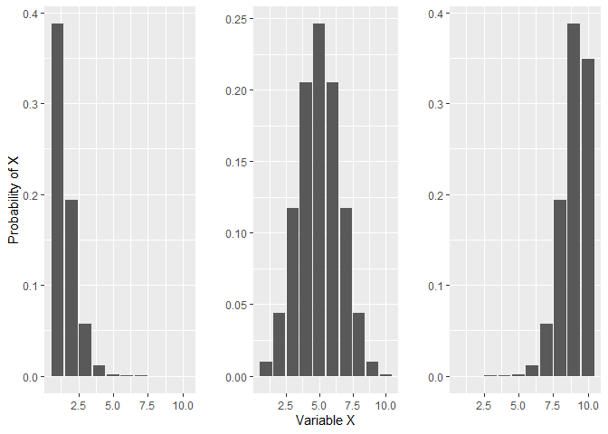
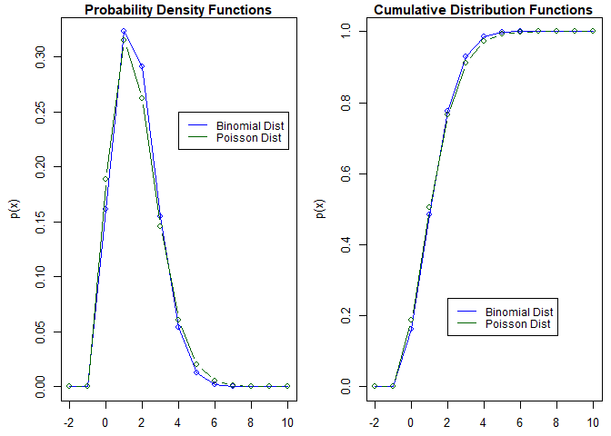
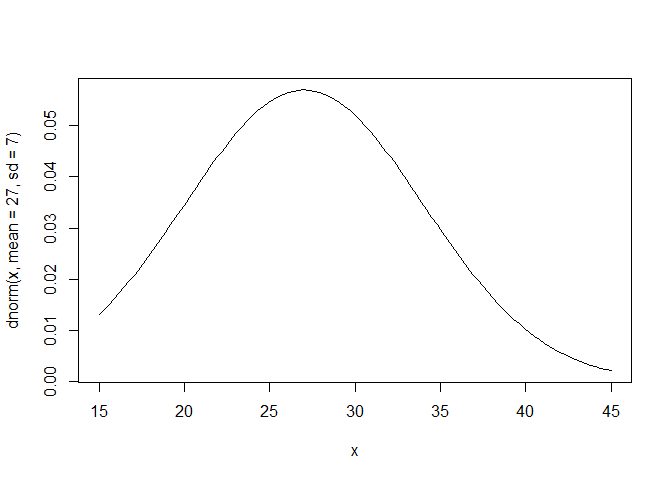
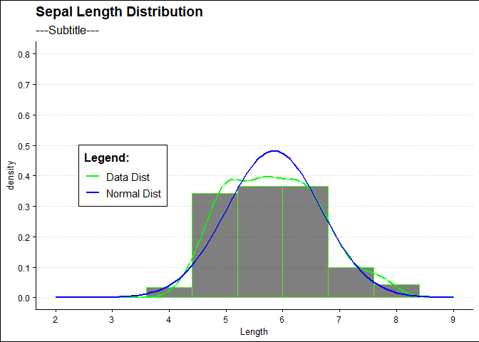
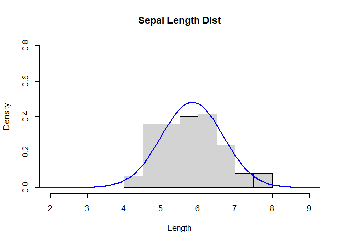
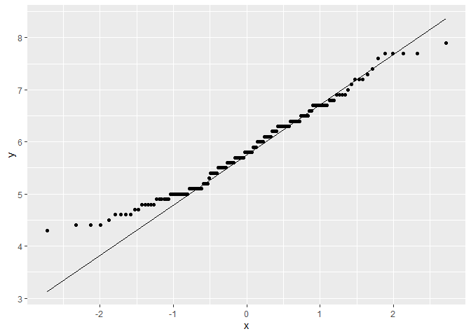
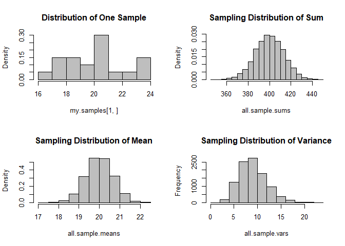
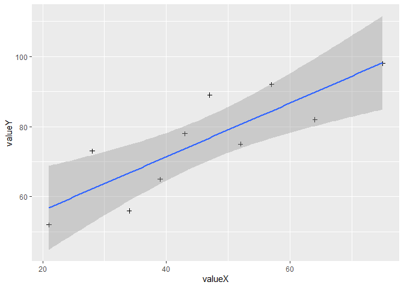

5. Probability
================
Antonio Dagnino Mendez
3/12/2021

## Libraries

``` r
library(ggplot2)
```

    ## Warning: package 'ggplot2' was built under R version 4.0.5

``` r
library(ggthemes)
```

    ## Warning: package 'ggthemes' was built under R version 4.0.4

``` r
library(gridExtra)
```

    ## Warning: package 'gridExtra' was built under R version 4.0.4

## Binomial Probability Distribution

``` r
### Binomial distribution ###


#exact prob binomial (PROBABILITY DENSITY FUNCTION)
# x = exact number of successes or failures
# size = total number of trials
# prob = probability of success of failure per trial (relative frequency formula could be used to define this)
# Example: exact probability of having EXACTLY 3 'six' when rolling 10 dice (Answer is 15,5 %)
dbinom(x=3,size=10,prob=1/6)
```

    ## [1] 0.1550454

``` r
# equal or less than binomial probability (CUMULATIVE DISTRIBUTION FUNCTION)
# q= Number of successes or failures will be EQUAL OR LESS than this number (equal or less than)
# size = total number of trials
# prob = probability of success (relative frequency formula could be used to define this)
# Example: probability of getting THREE OR LESS 'six' when rolling 10 dice (answer is 93.02%)
pbinom(q=3,size=10,prob=1/6)
```

    ## [1] 0.9302722

``` r
#more than (AT LEAST) binomial probability distribution
# q= number of successes Number of successes or failures will be more than this number (more than)
# size= total number of trials
#prob = probability of success of failure per trial (relative frequency formula could be used to define this)
# Example: probability of getting FOUR or MORE 'six' when rolling 10 dice (answer is 6.97%)
pbinom(q=3,size=10,prob=1/6,lower.tail = F)
```

    ## [1] 0.06972784

``` r
# Inverse CDF
#p = probability or vector of probabilities (range from 0 to 1)
#size = total number of trials
#prob = probability per trials
# Example How many dice am I allowed to toss by ensuring 93.02% chances of success in my selections? (Answer is 3)
qbinom(p=0.93,size=10,prob=1/6)
```

    ## [1] 3

``` r
# Binomial distribution random values
# n = how many random numbers are needed
# size = number of trials
# prob = probability per trial. 0 means low successs and 1 means success all the time
# Result: a vector of final results: Each number represents the successes obtained in the # of trials specified in 'size'
# The resulting vector should correlate with the pbinom function results. Did you get the times you wanted or less?
rbinom(n=10,size=10,prob=1/6)
```

    ##  [1] 1 1 2 3 1 1 0 2 1 3

``` r
# Visualize binomial distribution when tossing 10 coins with low,fair and high probability of success

binom_df <- data.frame(
  "low_prob" = dbinom(1:10,size=10,prob=0.1),
  "fair_prob" = dbinom(1:10,size=10,prob=0.5),
  "high_prob" = dbinom(1:10,size=10,prob=0.9)

)


pl1 <- ggplot(data=binom_df,aes(x=1:10,y=low_prob)) + geom_col() +labs(x="",y="Probability of X")
pl2 <- ggplot(data=binom_df,aes(x=1:10,y=fair_prob)) + geom_col() +labs(x="Variable X",y="")
pl3 <- ggplot(data=binom_df,aes(x=1:10,y=high_prob)) + geom_col() + labs(x="",y="")

grid.arrange(pl1,pl2,pl3,ncol=3)
```

<!-- -->

## Poisson Probability distribution

``` r
#Example: Assume the average number of fatalities per year is 2.5

# Probability Density Function
#x= EXACT number of simple events (example 2 fatalities next year)
#lambda = average number of events during a period of time (example is 2.5 per year)
#Example: having exactly 2 events during the year (Answer is  25.56%)
dpois(x=2,lambda=2.5)
```

    ## [1] 0.2565156

``` r
# Cumulative distribution function
#q = EQUAL OR LESS THAN number of simple events
#lambda = average number of events during a period of time
#Example: EQUAL or LESS than 2.5 when  average is 2.5 (Answer is 54.38%)
ppois(q=2.5,lambda=2.5)
```

    ## [1] 0.5438131

``` r
#MORE THAN (AT LEAST) cumulative probability distribution
#q= MORE THAN number of simple events
#lambda= avg number of events during a period of time
# Example: More than 2 events when average is  2.5 (Answer is 71.12%)
ppois(q=2,lambda=2.5,lower.tail = F)
```

    ## [1] 0.4561869

``` r
#Inverse CDF
#p= Probability (Value between 0 and 1)
#lambda= average
#Example:number of accidents that will be seen if probability is 54.38% and average per year is 2.5? (Answer is 2)
qpois(p=0.5438,lambda=2.5)
```

    ## [1] 2

``` r
#Random values
#n= number of random values
#every value represents the number of events observed during a period of time. In other words,
#the number of fatalities occurred per event.
rpois(50,lambda=2.5)
```

    ##  [1] 0 0 0 2 2 2 4 1 2 1 3 1 3 2 4 0 2 1 2 2 8 1 2 2 3 1 3 2 2 3 1 2 4 3 3 3 2 2
    ## [39] 2 1 3 4 1 3 4 1 2 1 4 0

## Binomial Vs Poisson (The Poisson Approximation to the Binomial Distribution)

``` r
#In order to calculate this approximation, we need to calculate the mean in the
# binomial distribution function with formula mean = n*p
# Example: probability of getting THREE OR LESS 'six' when rolling 10 dice (answer is 93.02%)
binom_mean <- 10 * (1/6)

binomial_pdf <- round(dbinom(-2:10,10,1/6),4)
poisson_pdf <- round(dpois(-2:10,lambda=binom_mean),4)
binomial_cdf <- round(pbinom(-2:10,10,1/6),4)
poisson_cdf <- round(ppois(-2:10,lambda=binom_mean),4)

par(mfrow=c(1,2),cex=0.8,mai=c(0.4,0.7,0.2,0.1))

plot(x=-2:10,y=binomial_pdf,type="o",col="blue",main="Probability Density Functions",xlab="X values",ylab="p(x)")
lines(x=-2:10,y=poisson_pdf,type="b",col="dark green")
legend(4,0.25,legend=c("Binomial Dist","Poisson Dist"),col=c("blue","dark green"),lty=1,cex=0.9)


plot(x=-2:10,y=binomial_cdf,type="o",col="blue",main="Cumulative Distribution Functions",xlab="X values",ylab="p(x)")
lines(x=-2:10,y=poisson_cdf,type="b",col="dark green")
legend(2,0.25,legend=c("Binomial Dist","Poisson Dist"),col=c("blue","dark green"),lty=1,cex=0.9)
```

<!-- -->

## Hypergeometric Probability Distribution

``` r
#Example: A case of Whiskey has 12 bottles, but 3 of are spoiled. What is the probabilities of getting 1 spoiled
# if I grab 4 bottles from the case?

#Probability Density Function
# EXACT probability
# help section also gives a good example for hypergeometric distribution
#x= chances of having EXACTLY 1 spoiled bottle between the 4
#m= number of spoiled bottles
#n= remaiing number of bottles
#k= how many bottles are grabbed from the case
dhyper(x=0,m=3,n=9,k=4)
```

    ## [1] 0.2545455

``` r
#Another Example:
# One of the responsibilities of a forest conservation officer is to tag endangered
#deer for preventing illegal hunting. The forest has approximately 400 deer. Last
#week, 100 deer have been captured, tagged, then released, This week the officer 
#captured 125 deer.
# What is the probability that the officer captured 30 deer of those which have been captured
# and tagged last week?
dhyper(x=30,m=100,n=300,k=125)
```

    ## [1] 0.09507884

``` r
#Cumulative distribution function
#Example: Probability on getting ONE OR LESS spoiled whiskey bottle (Answer is 76.36%)
phyper(q=1,m=3,n=9,k=4)
```

    ## [1] 0.7636364

``` r
#Example: Probability on getting MORE THAN ONE spoiled bottle (Answer is 23.63%)
phyper(q=1,m=3,n=9,k=4,lower.tail = F)
```

    ## [1] 0.2363636

``` r
#Random Values
#nn= number of experiments. Every value means the number of spoiled bottles grabbed per event
rhyper(nn=10,m=3,n=9,k=4)
```

    ##  [1] 0 0 2 2 0 2 2 1 0 1

## The Normal Distribution

``` r
#Probability Density Function (PDF) in Normal distribution
#this function does not give probability. Instead, it gives density, which is the value of a point 
# in the gaussian bell given 'x' ('y' intercept).
#The reason for this is in normal distribution, the probability
#is determined by the area under the curve. So a point won't give probability.
#In R, this function is used to plot the gaussian bell
curve(dnorm(x,mean=27,sd=7),from=15,to=45)
```

<!-- -->

``` r
# Cumulative distribution function (CDF) in Normal Distribution
#The probability between 14.4 and 20.3 is (0.6272173). There are two ways to solve this:
#Option 1 by input 'x', 'mean' and 'sd' directly in the pnorm function. After that, subtract p(20.3) - p(14.4):
pnorm(20.3,mean=16,sd=sqrt(9)) - pnorm(14.4,mean=16,sd=sqrt(9)) #We use pnorm because is the Cumulative dist function
```

    ## [1] 0.6272173

``` r
#Option 2 by calculating the standardized values "z" for the random variables:
z1 <- (20.3 - 16) / sqrt(9)
z2 <- (14.4-16) / sqrt(9)
pnorm(z1) - pnorm(z2) # The result is the same (0.6272173). Since values are standardized, mean=0 and sd=1
```

    ## [1] 0.6272173

``` r
#Plotting the normal distribution with ggplot
ggplot(data=iris, aes(x=Sepal.Length)) +
geom_histogram(binwidth=0.8,fill="black",color="#56ea29", alpha=0.5,aes(y=..density..))+
geom_density(kernel="gaussian",col="green",linetype=5,size=1) + stat_density(aes(col="Data Dist"),geom="line")+ stat_function(fun=function(x){dnorm(x,mean=mean(iris$Sepal.Length),sd=sd(iris$Sepal.Length))},size=1,aes(col="Normal Dist")) + scale_colour_manual("Legend:",breaks=c("Data Dist","Normal Dist"),values=c("green","blue"))+ scale_x_continuous(breaks=2:9,limits = c(2,9))+ scale_y_continuous(breaks=seq(0,0.8,0.1),limits = c(0,0.8))+ labs(title="Sepal Length Distribution",x="Length",subtitle="---Subtitle---") + theme_clean()+ theme(legend.position = c(0.2,.5))
```

    ## Warning: Removed 1 rows containing missing values (geom_bar).

<!-- -->

``` r
#with built-in functions
hist(x=iris$Sepal.Length,probability = T, main = "Sepal Length Dist", xlab = "Length",ylab="Density",ylim =c(0,0.8),xlim=c(2,9))
curve(dnorm(x,mean=mean(iris$Sepal.Length),sd=sd(iris$Sepal.Length)),from=0,to=10,add=T,lwd=2,col="blue")
```

<!-- -->

``` r
#qqplot
# qqplot is a graphical technique for determining if two data sets come from populations with a common #distribution. If the data is normally distributed, the points in the qq-normal plot lie on a straight
#diagonal line.
ggplot(data=iris,aes(sample=Sepal.Length)) + stat_qq() + stat_qq_line()
```

<!-- -->

## Sampling Distribution

``` r
# Sampling distribution: A method used to obtain unknown statistical information from 
# the population based on data from the samples. For example, the mean, variance and sd.

library(gtools)
# permutations function will show all possible iterations between the elements of the population
# In other words, it will create all possible samples based on specific conditions:

#n= sample size
#r= how many observations will be taken at a time
#v= vector of observations (elements of the sample)
#repeats allowed = whether the observations could be repeated in the groups of observations taken at a time
# For example: if the observations are 1,2,3, repeats argument will allow 1,1 - 2,2 or 3,3 
#as elements taken at same time
population <- c(5,10,15)

q1 <- permutations(n=3,r=2,v=population,repeats.allowed = T)
q1
```

    ##       [,1] [,2]
    ##  [1,]    5    5
    ##  [2,]    5   10
    ##  [3,]    5   15
    ##  [4,]   10    5
    ##  [5,]   10   10
    ##  [6,]   10   15
    ##  [7,]   15    5
    ##  [8,]   15   10
    ##  [9,]   15   15

``` r
#q1 will be a matrix ox values. Every row represents a sample
# We will demonstrate the mean of the means of the samples will be
# close to the mean of the population


#get the mean of every sample
sample_means <- rowMeans(q1)
sample_means
```

    ## [1]  5.0  7.5 10.0  7.5 10.0 12.5 10.0 12.5 15.0

``` r
#Compare population mean vs mean of sample means

mean(population) == mean(sample_means)
```

    ## [1] TRUE

## The Central Limit Theorem

``` r
#The CLT says that if you take many repeated samples from a population,
# and calculate the averages or sums of each one,
# the collection of those averages  and sums will be normally distributed


#From https://www.r-bloggers.com/sampling-distributions-and-central-limit-theorem-in-r/
# we can get a function that demonstrates this. It plots  one of 9 possible distribution functions,
# then you have to input number of samples 'n' and two params optional: 'mean' and 'sd'


sdm.sim <- function(n,src.dist=NULL,param1=NULL,param2=NULL) {
  r <- 10000 # Number of replications/samples - Not to be adjusted
  # This produces a matrix of observations with
  # n columns and r rows. Each row is one sample:
  my.samples <- switch(src.dist,
                       "E" = matrix(rexp(n*r,param1),r),
                       "N" = matrix(rnorm(n*r,param1,param2),r),
                       "U" = matrix(runif(n*r,param1,param2),r),
                       "P" = matrix(rpois(n*r,param1),r),
                       "C" = matrix(rcauchy(n*r,param1,param2),r),
                       "B" = matrix(rbinom(n*r,param1,param2),r),
                       "G" = matrix(rgamma(n*r,param1,param2),r),
                       "X" = matrix(rchisq(n*r,param1),r),
                       "T" = matrix(rt(n*r,param1),r))
  all.sample.sums <- apply(my.samples,1,sum)
  all.sample.means <- apply(my.samples,1,mean)
  all.sample.vars <- apply(my.samples,1,var)
  par(mfrow=c(2,2))
  hist(my.samples[1,],col="gray", freq = F,
       main="Distribution of One Sample")
  hist(all.sample.sums,col="gray", freq = F,
       main="Sampling Distribution of Sum")
  hist(all.sample.means,col="gray", freq = F,
       main="Sampling Distribution of Mean")
  hist(all.sample.vars,col="gray",
       main="Sampling Distribution of Variance")}


#1. (Normal Distribution) Call the previously declared function sdm.sim with n = 20
#and a sample withdrawn from a Normal distribution of mean 20 and standard deviation of 3.
sdm.sim(20,src.dist="N",param1=20,param2=3)
```

<!-- -->

## Linear Regression

``` r
linear_model <- function(xi,yi,n){
  Sxy <- sum(xi*yi) - (sum(xi)*sum(yi))/n
  Sxx <- sum(xi^2) - (sum(xi)^2/n)
  Syy <- sum(yi^2) - (sum(yi)^2/n)
  b <- Sxy / Sxx
  a <- (sum(yi)/n) - (b*(sum(xi)/n))
  SST <- sum(yi^2) - (sum(yi)^2/n)
  SSR <- Sxy^2 / Sxx
  SSE <- SST - SSR
  MSE <- SSE / (n-2)
  MSR <- SSR
  SE <- sqrt(MSE/Sxx)
  r2 <- SSR/SST
  r <- Sxy/sqrt(Sxx*Syy)
  f <- MSR / MSE
  RSE <- sqrt(MSE)
  t <- (b-0)/sqrt(MSE/Sxx)
  p <- pt(q=t,df=n-2,lower.tail = F)*2
  return(data.frame("Slope b" = b, # inclination of line
                    "Intercept a" = a, #value of 'y' when x = 0
                    "SSTotal"=SST,     # total sum of errors SSR+SSE
                    "SSRegression" = SSR, #Error between mean 'y' and 'y' value in fitted line 
                    "SSError"=SSE,  #Error between 'y' value in fitted line and real value of 'y'
                    "MSE"=MSE, #Average SSE with 2 degrees of freedom
                    "MSR"=MSR, #
                    "SE"=SE,   # standard error is error of slope (coefficient).
                    "R-squared"=r2, #coefficient of determination. used to measure strength of relationship. This also represents the percentage of error that can be explained. this is equal to correlation squared
                    "correlation r"=r, #correlation coefficient
                    "ResidualError RSE"=RSE, #mean error between predicted y and real y
                    "F-Static"=f,
                    "t"=t, #Test the hypothesis that there is a linear relationship bet 'x' and 'y' (you will need the Critical values of t table 4 in book. Also, you'll need df and t/2 to test at 5% level of significance)
                    "p"=p))  # p value is used to test a hypothesis given alpha value (normally 0.05). If p-value is less than 0.05 you can reject the null hypothesis.
 }

n= 10
xi = c(39,43,21,64,57,47,28,75,34,52)
yi = c(65,78,52,82,92,89,73,98,56,75)

result <- linear_model(xi,yi,n)

x <- 39
y <- result[2] + result[1]*x
cor(x=xi,y=yi)
```

    ## [1] 0.8397859

``` r
###--- Linear model by using lm and predict functions ---

temp.df <- data.frame(         #Create data frame so it could be put in lm formula
  "valueY"=yi,                 #'y' and 'x' values need to be input in df form 
  "valueX"=xi                 #values input in vector will cause an error in predict function
)

slmodel <- lm(formula=valueY~valueX,data=temp.df)
summary(slmodel)
```

    ## 
    ## Call:
    ## lm(formula = valueY ~ valueX, data = temp.df)
    ## 
    ## Residuals:
    ##     Min      1Q  Median      3Q     Max 
    ## -10.813  -5.629  -2.531   6.758  12.234 
    ## 
    ## Coefficients:
    ##             Estimate Std. Error t value Pr(>|t|)   
    ## (Intercept)  40.7842     8.5069   4.794  0.00137 **
    ## valueX        0.7656     0.1750   4.375  0.00236 **
    ## ---
    ## Signif. codes:  0 '***' 0.001 '**' 0.01 '*' 0.05 '.' 0.1 ' ' 1
    ## 
    ## Residual standard error: 8.704 on 8 degrees of freedom
    ## Multiple R-squared:  0.7052, Adjusted R-squared:  0.6684 
    ## F-statistic: 19.14 on 1 and 8 DF,  p-value: 0.002365

``` r
values_topredict <- data.frame("valueX"= xi)  #values to predict also need to be df
predict(slmodel,newdata=values_topredict)
```

    ##        1        2        3        4        5        6        7        8 
    ## 70.64107 73.70331 56.86095 89.78011 84.42118 76.76556 62.21989 98.20129 
    ##        9       10 
    ## 66.81326 80.59337

``` r
ggplot(data=temp.df,aes(x=valueX,y=valueY))+geom_point(shape=3)+geom_smooth(method=lm,se=T)
```

    ## `geom_smooth()` using formula 'y ~ x'

<!-- -->

## Correlation

``` r
#Pearson Correlation
n= 10
xi <- c(39,43,21,64,57,47,28,75,34,52)
yi <- c(65,78,52,82,92,89,73,98,56,75)

pear_corr <- sum ( (xi-mean(xi))*(yi-mean(yi)) ) / ((n-1)*sd(xi)*sd(yi)) #option 1 formula (there is another way to express this pearson correlation by using other formula)
print(pear_corr)
```

    ## [1] 0.8397859

``` r
cor(xi,yi,method="pearson") #same value as formula above #value is 0.8397
```

    ## [1] 0.8397859

``` r
#Spearman Correlation
cor(xi,yi,method="spearman") #value is 0.8787
```

    ## [1] 0.8787879

``` r
# Relationship between covariance and correlation

cor(x=xi, y=yi) * ( sd(xi)*sd(yi) ) == cov(x=xi,y=yi)
```

    ## [1] TRUE

``` r
#According to the formula, the correlation is the covariance of two variables divided
# by the product of the standard deviations of these two variables

# The covariance shows a measure of the variability of two random variables together
# The covariance can be used to represent the direction of the relationship:
# Positive covariance will say the variables are directly proportional 
# and negative means they're inversely proportional
#The correlation can be used to determine the direction and strength of the relationship
#between the variables
```

## Hypothesis Testing / t-test

``` r
##### One sample t test #####

"
A bottle filling machine is set to fill bottles with soft drink to a volume of 500 ml. The
actual volume is known to follow a normal distribution. The manufacturer believes the
machine is under-filling bottles. A sample of 20 bottles is taken and the volume of liquid
inside is measured.
The volumes were: 484.11, 459.49, 471.38, 512.01, 494.48, 528.63, 493.64, 485.03, 473.88,
501.59, 502.85, 538.08, 465.68, 495.03, 475.32, 529.41, 518.13, 464.32, 449.08, 489.27
(a) Calculate the sample mean and standard deviation.
(b) Use a one-sample t-test to determine whether the bottles are being consistently
under filled using a significance level of 0.01.

H0: mean >= 500 
Ha: mean < 500
test type: left tailed

"
```

    ## [1] "\nA bottle filling machine is set to fill bottles with soft drink to a volume of 500 ml. The\nactual volume is known to follow a normal distribution. The manufacturer believes the\nmachine is under-filling bottles. A sample of 20 bottles is taken and the volume of liquid\ninside is measured.\nThe volumes were: 484.11, 459.49, 471.38, 512.01, 494.48, 528.63, 493.64, 485.03, 473.88,\n501.59, 502.85, 538.08, 465.68, 495.03, 475.32, 529.41, 518.13, 464.32, 449.08, 489.27\n(a) Calculate the sample mean and standard deviation.\n(b) Use a one-sample t-test to determine whether the bottles are being consistently\nunder filled using a significance level of 0.01.\n\nH0: mean >= 500 \nHa: mean < 500\ntest type: left tailed\n\n"

``` r
bottles <- c(484.11, 459.49, 471.38, 512.01, 494.48, 528.63,
493.64, 485.03, 473.88, 501.59, 502.85, 538.08, 465.68, 495.03,
475.32, 529.41, 518.13, 464.32, 449.08, 489.27)

t.test(bottles, mu=500, alternative = "less", conf.level = 0.99)
```

    ## 
    ##  One Sample t-test
    ## 
    ## data:  bottles
    ## t = -1.5205, df = 19, p-value = 0.07243
    ## alternative hypothesis: true mean is less than 500
    ## 99 percent confidence interval:
    ##      -Inf 505.6495
    ## sample estimates:
    ## mean of x 
    ##  491.5705

``` r
"
p-value 0.07 / alpha 0.01
pvalue > alpha

Fail to Reject

"
```

    ## [1] "\np-value 0.07 / alpha 0.01\npvalue > alpha\n\nFail to Reject\n\n"

``` r
##### Independent two sample t test ##### 
"
An auto manufacturer has two plants that
produce the same car.
They are forced to close one of the plants.
The company wants to know if there’s a
significant difference in production between
the two plants and decide which plant to close

H0: PlantA <= PlantB
Ha: PlantA > PlantB
"
```

    ## [1] "\nAn auto manufacturer has two plants that\nproduce the same car.\nThey are forced to close one of the plants.\nThe company wants to know if there’s a\nsignificant difference in production between\nthe two plants and decide which plant to close\n\nH0: PlantA <= PlantB\nHa: PlantA > PlantB\n"

``` r
plantA <- c(1184, 1203, 1219, 1238, 1243, 1204, 1269, 1256, 1156, 1248)
plantB <- c(1136, 1178, 1212, 1193, 1226, 1154, 1230, 1222, 1161, 1148)


t.test(plantA, plantB, alternative="greater",paired=F)
```

    ## 
    ##  Welch Two Sample t-test
    ## 
    ## data:  plantA and plantB
    ## t = 2.2796, df = 18, p-value = 0.01752
    ## alternative hypothesis: true difference in means is greater than 0
    ## 95 percent confidence interval:
    ##  8.614967      Inf
    ## sample estimates:
    ## mean of x mean of y 
    ##      1222      1186

``` r
"
t value = 2.279
critical value = 1.734 (from t-test table)
Test type: Lower tailed

t value > critical value
Reject Null hypothesis

"
```

    ## [1] "\nt value = 2.279\ncritical value = 1.734 (from t-test table)\nTest type: Lower tailed\n\nt value > critical value\nReject Null hypothesis\n\n"

``` r
##### Dependent two sample t test (Paired) #####

"
Compare the difference in wear in two types of tires

H0: meanA = meanB
Ha: meanA != meanB
"
```

    ## [1] "\nCompare the difference in wear in two types of tires\n\nH0: meanA = meanB\nHa: meanA != meanB\n"

``` r
TireA <- c(10.6, 9.8, 12.3, 9.7, 8.8)
TireB <- c( 10.2, 9.4, 11.8, 9.1, 8.3)

t.test(TireA,TireB,alternative = "two.sided",paired = T)
```

    ## 
    ##  Paired t-test
    ## 
    ## data:  TireA and TireB
    ## t = 12.829, df = 4, p-value = 0.0002128
    ## alternative hypothesis: true difference in means is not equal to 0
    ## 95 percent confidence interval:
    ##  0.3761149 0.5838851
    ## sample estimates:
    ## mean of the differences 
    ##                    0.48

``` r
"
t-statistic: 12.829
critical value: 2.776
t-statistic > critical value
Reject null hypothesis
"
```

    ## [1] "\nt-statistic: 12.829\ncritical value: 2.776\nt-statistic > critical value\nReject null hypothesis\n"

### Chi-Square

### ANOVA
